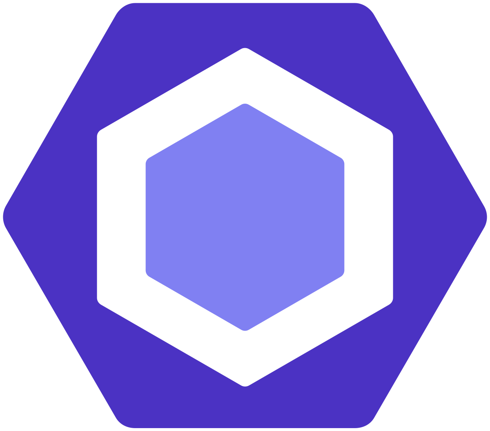

  

## The Goal of Having Standards
Having established standards as a way to measure the quality of something is important. When a car is manufactured, it needs to meet certain manufacturing and safety standards to ensure that it is a safe and effective product for the driver. In powerlifting, there are certain standards for each lift that must be met or else the lifter is not given that lift as a successful attempt. There need to be guidelines to quantify things as satisfactory and unsatisfactory, and setting standards fulfills that purpose.

## Standards In Coding
I am a proponent of having coding standards. In previous courses, I have been exposed to the idea of having coding standards, which I will explore later on. Setting a good standard for how code should be written brings nothing but benefits. Code written according to good standards is more readable and usable by other software developers. In the software engineering field, where collaboration is necessary, team/project members need to be able to read and understand each other’s code. If anything is ambiguous, the team is less efficient because time would need to be spent figuring out the purpose of said ambiguous thing. Coding standards enforce clarity and consistency above all else, in turn improving efficiency and collaborative cohesion.

  

## An Anecdote With ESLint
In my short experience using ESLint, I am a big fan. I think that the goal of obtaining the green checkmark is very motivating and that it forces me to write readable and purposeful code. It really helps me clean up the “lint” in my code. When doing the practice assignments, I did not find getting the green check mark to be that bad of an ordeal, but rather a simple task. This is probably due to being familiar with the idea of coding standards, as I said before.

## A Short Story and Realization
I was first introduced to the idea of coding standards when I took ICS 111 at Leeward Community College in the Spring 2021 semester. From what I remember, the coding standard boiled down to giving variables and methods meaningful names, and following commenting conventions for different portions of code. I made sure to follow coding standards as best as I could for all of my assignments, so I would not get points taken off. However, other people in class complained about getting marked off for bad variable names and not leaving comments on pieces of code. They thought it was stupid that we had to comment on practically everything, and I understood their sentiment.

However, I now have the view that commenting on everything leaves nothing ambiguous and only improves readability. There is something to be said about being concise - excessive amounts of comments may very well hinder readability. There is an upper limit. I am happy that an earlier course exposed me to this idea of coding standards, as it is going to be important throughout the rest of this software engineering course, as well as my future career.

## Takeaway
Coding standards are important and I find the usage of them to be very useful and beneficial. Following a standard improves readability and usability of code, ensuring effectiveness and efficiency. I will take this with me throughout my coursework and my future career.

###### Note: ChatGPT assisted in writing this essay with grammar.
