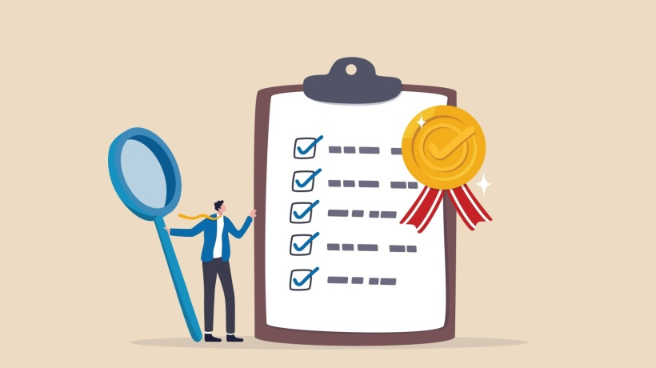

  

## Looking Good
“Looksmaxxing” is a slang term which, according to Wikipedia,  is a practice involving several forms of body care routines, in an effort to improve one's physical appearance. Throughout my experience with Bootstrap, I felt that using Bootstrap allowed my assignments to “looksmaxx.”

## Prior Experience
Before, when I was in high school, I remember using HTML, CSS, and JavaScript for a couple of projects. I also remember hating using just HTML and CSS. I am not really an artistic type, so designing a page that “looked good” was hard. Styling the webpages for my high school projects took the longest out of any components, which frustrated me. I remember times where I let my anger out verbally towards my computer, and end up taking a break out of rage. Using only raw HTML and CSS for a user interface is something I would not wish on my worst enemies.

I also remember a previous assignment from ICS 211 that involved the Java user interface. I created a tic-tac-toe game in Java with different Java libraries like Swing and AWT (abstract window toolkit). I did not care much about doing this. Sure, it is nice to know how these things work and how to implement them, but that does not mean I would enjoy doing it all the time.

  

## Exposure to Bootstrap
When it came to Bootstrap, it was very interesting to learn and use. I really enjoyed that I did not have to write as much CSS, because Bootstrap did a lot of things for me. There was the occasional CSS class I had to write for the assignments, but Bootstrap minimized this. Using Bootstrap was exponentially easier and faster than writing my own CSS classes for every single little thing on a webpage. Bootstrap turned hours of styling work into minutes. Bootstrap effectively turned the tedious thing that I dearly hated into something less tedious that I moderately dislike.

## Takeaways
I still do not like doing user-interface related things. I understand that having a good user-interface is important. A good user interface makes a user happy and is easy on the eyes. However, as of right now, I am not the person to ask when it comes to designing an amazing interface. If I was asked, I would be able to come up with something. Would it look usable? Yes. Decent? Doable. Amazing? Good luck. Bottom line, it is something that I am able to do, but I would absolutely hate doing it all the time, even if that means I would get better at it over time.

All in all, learning Bootstrap was cool because I now have a way to cut down on time spent doing something I do not like, that being designing a decent user interface. I hope to learn more frameworks that make this design process even easier, allowing my web pages to “looksmaxx.”

## Takeaway
Coding standards are important and I find the usage of them to be very useful and beneficial. Following a standard improves readability and usability of code, ensuring effectiveness and efficiency. I will take this with me throughout my coursework and my future career.

###### Note: ChatGPT assisted with grammar in writing this essay.
