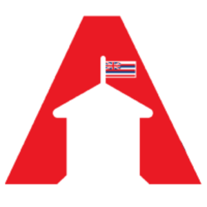

  

## The Challenge
The challenge that my team chose to tackle was creating a ChatBot for the Office of Hawaiian Affairs (OHA). The problem that OHA needed to solve was to improve the flow of information between OHA and beneficiaries. The system in place was inefficient because the main way beneficiaries would obtain information was through phone calls, in-person visits, emails, and through the OHA website. OHA wanted a way to streamline this process through the use of a chatbot, where beneficiaries could ask questions and receive accurate information in a timely manner. 

## My Contribution
I was mainly responsible for the documentation of our submission, and took on the role of being team leader. I wrote up all of the details of our submission and recorded a demo video. I delegated responsibilities to everyone, set times to meet where we would all work together and collaborate with different parts, and assisted other team members when needed. I provided direction and helped keep the team on track to submit a quality project in a timely fashion. 

## My Takeaways
I learned a lot from this experience. I learned about the different resources available for use in development, like the Dialogflow API, that exist outside of regular programming languages like Python or JavaScript. I also was able to improve my leadership and teamwork skills because I provided direction to teammates, and also jumped between helping each of them with their parts when they hit a roadblock, along with doing my own part of the project. 

Our Github repository for this project is [here](https://github.com/HACC2021/MGK).
Our Devpost submission for this project is [here](https://devpost.com/software/mgk).
Our deployment of our solution is [here](https://hacc2021.github.io/MGK/).
