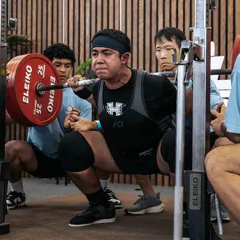

  

## The Sport of Powerlifting
Powerlifting is a strength sport where competitors are put into different divisions based on their age, as well as different weight classes, and demonstrate their strength on three main lifts. The three main lifts in powerlifting are the squat, bench press, and the deadlift. The objective for competitors is to lift as heavy as possible to achieve the highest total across all three lifts in each age division and weight class, where total means the weight that a competitor squatted, bench pressed, and deadlifted added together. For each lift, a competitor is given three attempts, where the lifter is judged on whether or not the lift meets the standard laid out in the rulebook. 

## My Experience
I have been training for powerlifting for over a year, and competed in November 2023 in the 2023 USA Powerlifting Lokahi Open. My official prep/peak for the meet started about five weeks out. During prep, training intensity was much higher in order to push and break past my previous limits. With this higher intensity came a lot of things, like higher fatigue, soreness, mental pressure, and more. I trained for this meet while being a full-time student and working part-time, so time management was important in order for me to keep up with school work and get my training sessions in. It took discipline to maintain my nutrition and not purposefully miss training sessions while feeling heavily fatigued and mentally stressed. 

## Meet Results
In the end, I had a great meet and squatted 227.5 kgs(501 lbs), bench pressed 122.5 kgs (270 lbs), and deadlifted 240 kgs (529 lbs). I made eight out of nine total attempts and achieved a total of 590 kgs (1,301 lbs).
