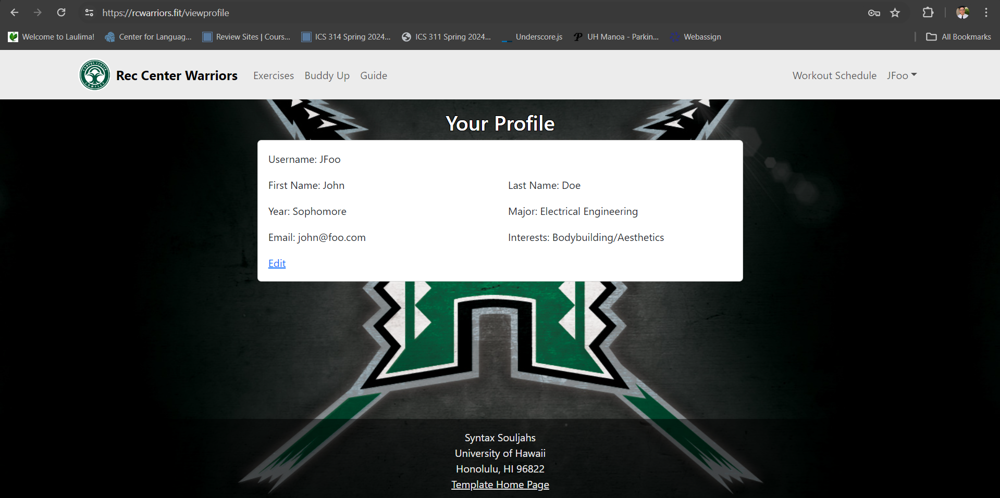
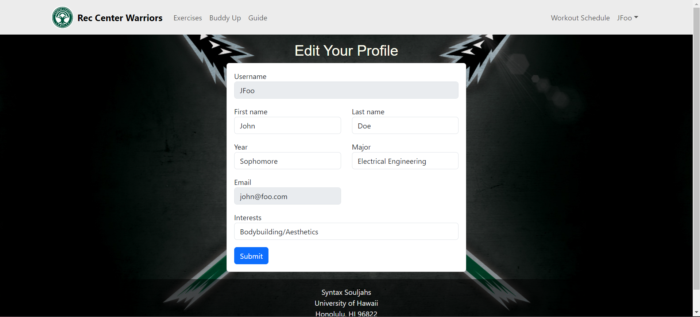

    
    

## The Project
The project my team chose to undertake for ICS 314 was to create an app that would allow students of UH Manoa to find a gym buddy. Going to the gym can be intimidating, especially if you are new to working out or do not know anyone. By not working out or exercising, students are missing out on great physical and mental health benefits. Our app, Rec Center Warriors, is a way for students to find a gym partner to work out with at the Warrior Recreation Center (WRC). This project was developed by me, Tyler Mak, Isai Foglesong, Javin Solmirin, Alvin Wu, Shane Baclig, and Ronan Russel Andal. This project utilized the Meteor framework, React, and MongoDB. At the bottom of this page, there are links to the GitHub repository and project page for this project.

## My Contribution
I took on the role of being team leader for this project. At the start of the project, everything was fairly disorganized. We had a general idea of what we wanted to do, but we had no clear direction, and we all did not seem to be on the same page. We were not creating branches for issues, and someone even committed directly to the main branch. I asked the group if it was okay for us to essentially restart on a fresh repository in order to do things the right way. I created a new repository, and was the main person managing the issue board for milestones 1 through 3. I also drafted some rough drawings that my group members could use as a reference when working on their specific pages. 

That is not to say that I did not do any work myself. I was more than just a manager with a clipboard that does not do anything to help. I was responsible for user profiles and all of its functionality. I modified the sign-up form from the template we started on to create an account and add a profile to the database. I created pages where users could view or edit their profile as necessary. I also reviewed everyone's pull requests in order to mitigate merge conflicts or other issues. Whenever a teammate was having issues, I would take a look and see what I could do to fix it. The pages above showcase the features I implemented into our application. 

## Takeaways
In all honesty, this project was a lot of fun. This project really forced me to be comfortable with React, Meteor, and MongoDB, as familiarity with these three technologies was necessary to complete this project. I also learned that for a group project, a leader is very important. I am not trying to make myself seem better than my group members, as they put in their share of work to complete the project, and are more than competent. However, I do feel that if I did not step up, or anyone for that matter, our project would not have turned out as well as it did. I mentioned before that we had no direction, and we did not seem to be on the same page when starting. With no one stepping up, these problems would have persisted, and the project would run in circles. I am happy my group members were not in opposition of me stepping up to lead and I am grateful for them listening to me. Leading my group through this project taught me a lot about how to manage a group project and work with others to make sure things get done. 

Our Github repository for this project is [here](https://github.com/Syntax-Souljahs/RecCenterWarriors).
Our project page is [here](https://syntax-souljahs.github.io/).
Our deployment of our solution is [here](https://rcwarriors.fit/).
